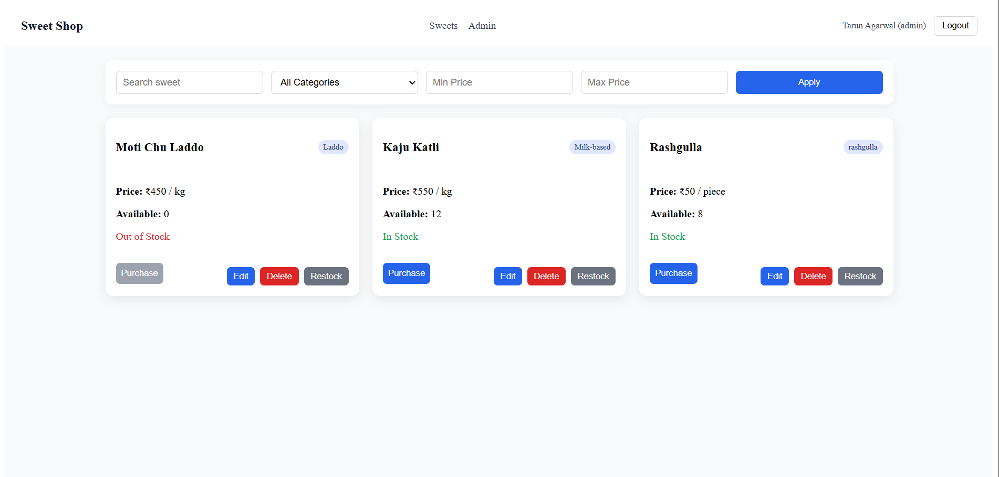
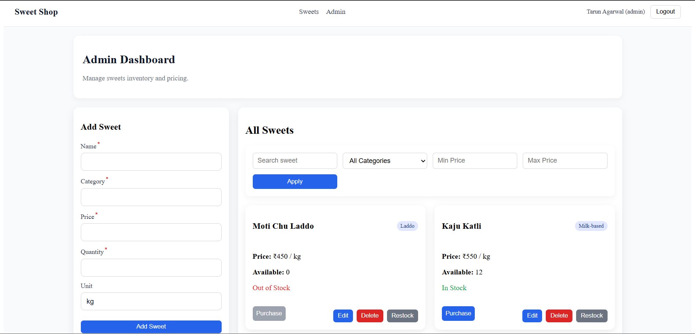

# Sweet Shop Management System

**Project explanation**

This repository contains a full-stack Sweet Shop Management System: a React + Vite frontend in the `client` folder and an Express/Mongoose backend in the `server` folder. The app supports user authentication, an admin dashboard for managing sweets, and a public listing for customers.

**Features**
- **User authentication** (register / login)
- **Admin dashboard** to create/update/delete sweets
- **Frontend** built with React, Vite, Redux Toolkit
- **Backend** built with Express and Mongoose (MongoDB)

**Tech stack**
- **Frontend:** React, Vite, React Router, Redux Toolkit, Axios
- **Backend:** Node.js, Express, Mongoose, JWT, bcrypt

**Repository layout**
- Frontend files: [client](client)
- Backend files: [server](server)

**Quick Links**
- Package files: [client/package.json](client/package.json) • [server/package.json](server/package.json)

**Setup & Run (local)**

Prerequisites:
- Node.js (v18+ recommended)
- MongoDB (local or Atlas)

Backend (server):

1. Install dependencies:

```powershell
cd server
npm install
```

2. Add environment variables: create `server/.env` with at least:

- `MONGO_URI` — MongoDB connection string
- `JWT_SECRET` — secret for signing tokens
- `PORT` — optional port

3. Start the backend:

```powershell
node app.js
# or use nodemon for auto-reload:
npx nodemon app.js
```

Frontend (client):

1. Install dependencies and run dev server:

```powershell
cd client
npm install
npm run dev
```

2. Open the URL shown by Vite (typically http://localhost:5173).

Linting:

```powershell
cd client
npm run lint
```

**Screenshots**

Add screenshots to `docs/screenshots` with names like `screenshot-1.png` and `screenshot-2.png`. Example insertion into this README:

```markdown


```

**My AI Usage**

- **Which AI tools I used:** GitHub Copilot and ChatGPT.
- **How I used them:**
  - I used ChatGPT to help draft and structure this README, to outline setup and troubleshooting steps, and to create the test report template.
  - I used GitHub Copilot while exploring the codebase to speed up writing small helper snippets and to suggest minor edits.
- **Reflection:** AI improved documentation speed and helped me think through edge cases for setup and environment configuration. Every suggestion was reviewed and adjusted to fit this project's specifics; AI was an assistant rather than a source of copy-pasted code.

**Publishing / Deliverables**

1. Public repo: created a public Git repository and push the project.

- Repository link: https://github.com/its-tarun-2505/sweet-shop-management-system

2. README: this file (README.md) includes the mandatory "My AI Usage" section and setup instructions.
